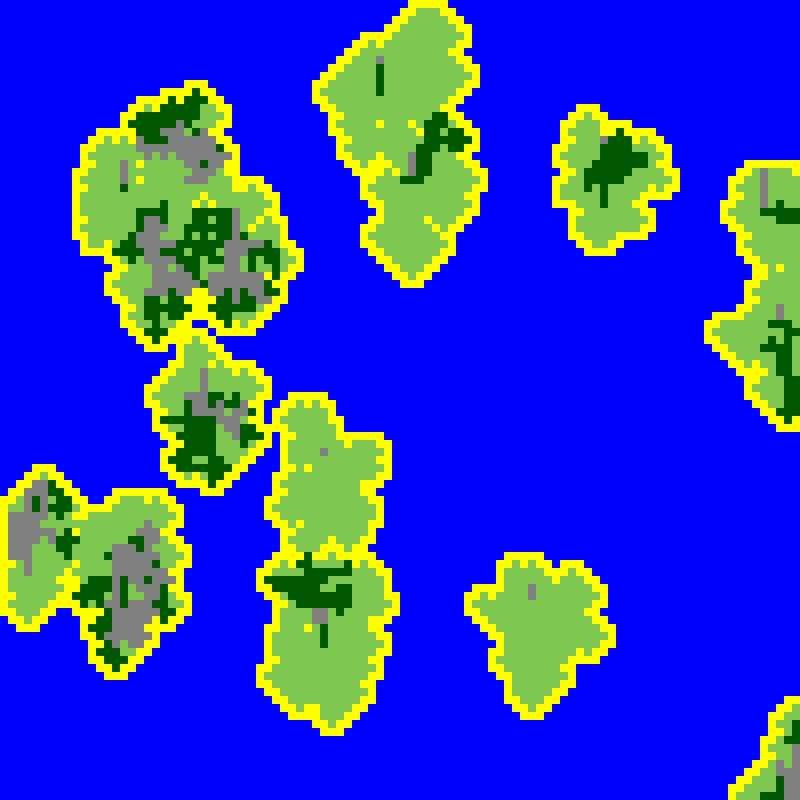

# mapgenerator

## formatting
Yes, I will use PSR-12 formatting if I were to work in your company. But if I write code for myself 
I will chose what's sensible and maybe this project will show you too that the PSR-12 formatting is 
nothing but stupid. 

## usage
Either start it locally with this: 
```
php -S localhost:8080 index.php
```
Or look up the php docker images. You need php-gd and php version 8.1.2 or higher. 

## example

